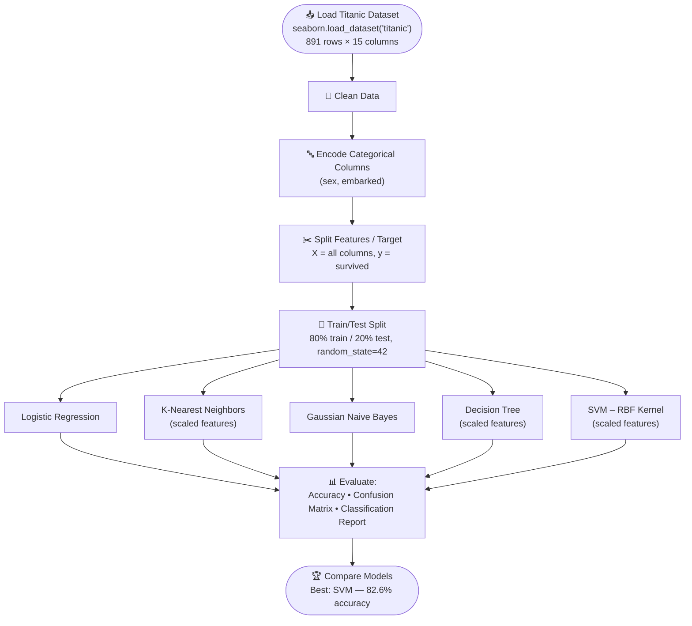
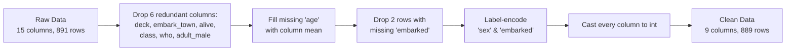

# 🚢 Titanic Survival Prediction

[](https://www.python.org/)
[](https://scikit-learn.org/)
[](https://jupyter.org/)

A machine learning project that predicts whether a Titanic passenger survived, using the classic Titanic dataset. Five different classification algorithms are trained on the same data and compared head-to-head so you can see which model handles this problem best.

---

## 📑 Table of Contents

- [Overview](#-overview)
- [Pipeline Diagram](#-pipeline-diagram)
- [Data Preprocessing in Detail](#-data-preprocessing-in-detail)
- [Dataset](#-dataset)
- [Models & Results](#-models--results)
- [Project Structure](#-project-structure)
- [Installation](#-installation)
- [Usage](#-usage)
- [Notes & Possible Improvements](#-notes--possible-improvements)

---

## 📌 Overview

The project answers one question: **"Given a passenger's details, would they have survived the Titanic disaster?"**

It works end-to-end in a single notebook:

1. Load the built-in Titanic dataset (via `seaborn`)
2. Clean and preprocess it (handle missing values, drop redundant columns, encode categories)
3. Split it into training and test sets
4. Train **5 classification models**
5. Evaluate and compare them using accuracy, confusion matrices, and classification reports

---

## 🔄 Pipeline Diagram



---

## 🧹 Data Preprocessing in Detail



**Why each step happens:**

| Step | What it does | Why |
|---|---|---|
| Drop columns | Removes `deck`, `embark_town`, `alive`, `class`, `who`, `adult_male` | These either duplicate other columns (e.g. `class` ≈ `pclass`, `alive` ≈ `survived`) or have too many missing values (`deck`) |
| Fill `age` | Replaces missing ages with the column mean | Keeps all 891 rows instead of dropping ~20% of the data |
| Drop `embarked` NaNs | Removes 2 rows with no embarkation port | Only 2 rows affected — safe to drop rather than impute |
| Label-encode | Converts `sex` and `embarked` from text to numbers | ML models require numeric input |
| Cast to `int` | Converts all columns to integer type | Simplifies the feature matrix for the models used |

---

## 🗂️ Dataset

The dataset comes from `seaborn.load_dataset("titanic")` — the well-known Titanic passenger manifest. After cleaning, these 9 columns remain:

| Column | Meaning | Encoding |
|---|---|---|
| `survived` | **Target** — did the passenger survive? | 0 = No, 1 = Yes |
| `pclass` | Ticket class | 1 = 1st, 2 = 2nd, 3 = 3rd |
| `sex` | Passenger gender | 0 = female, 1 = male |
| `age` | Age in years | missing values filled with the mean |
| `sibsp` | # siblings/spouses aboard | integer count |
| `parch` | # parents/children aboard | integer count |
| `fare` | Ticket fare | integer (truncated) |
| `embarked` | Port of embarkation | 0 = Cherbourg, 1 = Queenstown, 2 = Southampton |
| `alone` | Whether the passenger traveled alone | 0 = No, 1 = Yes |

---

## 🤖 Models & Results

Five classifiers are trained on an identical 80/20 train/test split (`random_state=42`) and scored on the held-out test set (178 passengers):

| Model | Accuracy | Macro F1 | Features |
|---|---|---|---|
| Logistic Regression | 80.3% | 0.79 | raw (unscaled) |
| K-Nearest Neighbors (k=5) | 78.1% | 0.77 | standardized |
| Gaussian Naive Bayes | 77.5% | 0.77 | raw (unscaled) |
| Decision Tree | 77.0% | 0.76 | standardized |
| **SVM (RBF kernel)** | **82.6%** | **0.81** | standardized |

**🏆 Best performer: SVM (RBF kernel)** — 82.6% accuracy, with the strongest balance between precision and recall on both classes (confusion matrix: 96 true negatives, 51 true positives out of 178 test samples).

Logistic Regression is a close second and is a good simpler/faster alternative if interpretability matters more than the last few points of accuracy.

---

## 📁 Project Structure

```
titanic-survival-main/
├── Untitled.ipynb              # Main notebook — full pipeline: load → clean → encode → train → evaluate
├── requirements.txt            # Python dependencies (added — see below)
└── README.md                   # You are here
```

> 💡 The notebook is currently named `Untitled.ipynb`. Renaming it to something like `titanic_survival_prediction.ipynb` is recommended for clarity if you push this to GitHub.

---

## ⚙️ Installation

```bash
# 1. Clone the repository
git clone <your-repo-url>
cd titanic-survival-main

# 2. (Optional) create a virtual environment
python -m venv venv
source venv/bin/activate      # Windows: venv\Scripts\activate

# 3. Install dependencies
pip install -r requirements.txt
```

---

## ▶️ Usage

```bash
jupyter notebook Untitled.ipynb
```

Then run all cells top to bottom (**Cell → Run All**). The notebook is self-contained — it downloads the dataset via `seaborn` on the first run, so no external data file is needed.

---

## 📝 Notes & Possible Improvements

A few things worth knowing if you build on this project:

- **Scaler bug:** the test set is scaled with `scaler.fit_transform(X_test)` instead of `scaler.transform(X_test)`. This refits the scaler on test data rather than reusing the training statistics — for correct methodology it should be `scaler.transform(X_test)`.
- **No cross-validation:** all accuracy numbers come from a single train/test split, so they can shift somewhat with a different `random_state`. K-fold cross-validation would give a more reliable estimate.
- **No hyperparameter tuning:** models use mostly default parameters. `GridSearchCV` or `RandomizedSearchCV` (e.g. tuning `C`/`gamma` for the SVM, `max_depth` for the Decision Tree, `n_neighbors` for KNN) would likely improve results further.
- **Decision Tree doesn't need scaling:** tree-based splits are scale-invariant, so training it on standardized features is harmless but unnecessary.
- **Mean imputation for `age`:** simple but can distort the distribution; a group-wise imputation (e.g. by `pclass`/`sex`) often performs better.
